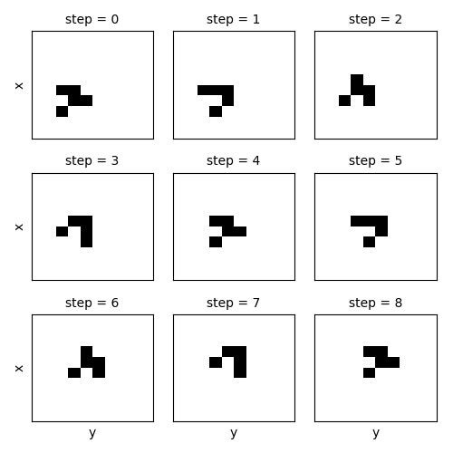

xarray-simlab: xarray extension for computer model simulations
==============================================================

|Build Status| |Coverage| |Doc Status| |Zenodo|

xarray-simlab is a Python library that provides both a generic
framework for building computational models in a modular fashion and a
xarray_ extension for setting and running simulations using the
xarray's ``Dataset`` structure. It is designed for fast, interactive
and exploratory modeling.

xarray-simlab is well integrated with other libraries of the PyData
ecosystem such as `dask <https://docs.dask.org>`_ and `zarr
<https://zarr.readthedocs.io>`_.

.. _xarray: http://xarray.pydata.org
.. |Build Status| image:: https://github.com/benbovy/xarray-simlab/workflows/test/badge.svg?branch=master
   :target: https://github.com/benbovy/xarray-simlab/actions?workflow=test
   :alt: Build Status
.. |Coverage| image:: https://codecov.io/gh/benbovy/xarray-simlab/branch/master/graphs/badge.svg?branch=master
   :target: https://codecov.io/github/benbovy/xarray-simlab?branch=master
   :alt: Coverage Status
.. |Doc Status| image:: http://readthedocs.org/projects/xarray-simlab/badge/?version=latest
   :target: http://xarray-simlab.readthedocs.io/en/latest/?badge=latest
   :alt: Documentation Status
.. |Zenodo| image:: https://zenodo.org/badge/93938479.svg
   :target: https://zenodo.org/badge/latestdoi/93938479
   :alt: Citation

In a nutshell
-------------

The Conway's Game of Life example shown below is adapted from this
`blog post <https://jakevdp.github.io/blog/2013/08/07/conways-game-of-life/>`_
by Jake VanderPlas.

1. Create new model components by writing compact Python classes,
   i.e., very much like dataclasses_:

.. code-block:: python

    import numpy as np
    import xsimlab as xs

    @xs.process
    class GameOfLife:
        world = xs.variable(dims=('x', 'y'), intent='inout')

        def run_step(self):
            nbrs_count = sum(
                np.roll(np.roll(self.world, i, 0), j, 1)
                for i in (-1, 0, 1) for j in (-1, 0, 1)
                if (i != 0 or j != 0)
            )
            self._world_next = (nbrs_count == 3) | (self.world & (nbrs_count == 2))

        def finalize_step(self):
            self.world[:] = self._world_next

    @xs.process
    class Glider:
        pos = xs.variable(dims='point_xy', description='glider position')
        world = xs.foreign(GameOfLife, 'world', intent='out')

        def initialize(self):
            x, y = self.pos

            kernel = [[1, 0, 0],
                      [0, 1, 1],
                      [1, 1, 0]]

            self.world = np.zeros((10, 10), dtype=bool)
            self.world[x:x+3, y:y+3] = kernel

2. Create a new model just by providing a dictionary of model components:

.. code-block:: python

    model = xs.Model({'gol': GameOfLife,
                      'init': Glider})

3. Create an input ``xarray.Dataset``, run the model and get an output
   ``xarray.Dataset``:

.. code-block:: python

    input_dataset = xs.create_setup(
        model=model,
        clocks={'step': np.arange(9)},
        input_vars={'init__pos': ('point_xy', [4, 5])},
        output_vars={'gol__world': 'step'}
    )

    output_dataset = input_dataset.xsimlab.run(model=model)

.. code-block:: python

    >>> output_dataset
    <xarray.Dataset>
    Dimensions:     (point_xy: 2, step: 9, x: 10, y: 10)
    Coordinates:
      * step        (step) int64 0 1 2 3 4 5 6 7 8
    Dimensions without coordinates: point_xy, x, y
    Data variables:
        init__pos   (point_xy) int64 4 5
        gol__world  (step, x, y) bool False False False False ... False False False

4. Perform model setup, pre-processing, run, post-processing and
   visualization in a functional style, using method chaining:

.. code-block:: python

    import matplotlib.pyplot as plt

    with model:
        (input_dataset
         .xsimlab.update_vars(
             input_vars={'init__pos': ('point_xy', [2, 2])}
         )
         .xsimlab.run()
         .gol__world.plot.imshow(
             col='step', col_wrap=3, figsize=(5, 5),
             xticks=[], yticks=[],
             add_colorbar=False, cmap=plt.cm.binary)
        )

.. _dataclasses: https://docs.python.org/3/library/dataclasses.html

Documentation
-------------

Documentation is hosted on ReadTheDocs:
http://xarray-simlab.readthedocs.io

License
-------

3-clause ("Modified" or "New") BSD license,
see `License file <https://github.com/benbovy/xarray-simlab/blob/master/LICENSE>`__.

xarray-simlab uses short parts of the code of the xarray_, pandas_ and
dask_ libraries. Their licenses are reproduced in the "licenses"
directory.

.. _pandas: http://pandas.pydata.org/

Acknowledgment
--------------

This project is supported by the `Earth Surface Process Modelling`_
group of the GFZ Helmholtz Centre Potsdam.

.. _`Earth Surface Process Modelling`: http://www.gfz-potsdam.de/en/section/earth-surface-process-modelling/

Citation
--------

If you use xarray-simlab in a scientific publication, we would
appreciate a `citation`_.

.. _`citation`: http://xarray-simlab.readthedocs.io/en/latest/citation.html
