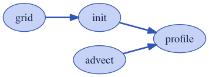
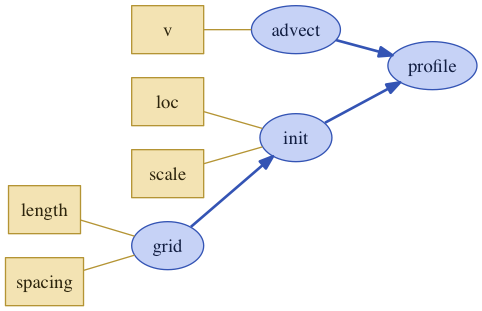
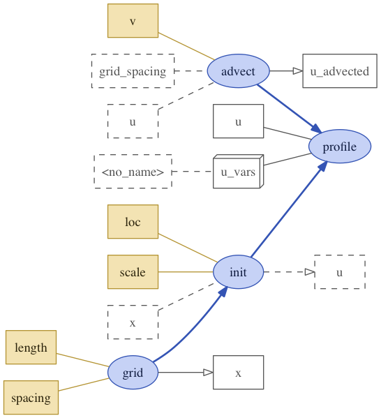
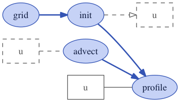

.. _inspect_model:

Inspect Models
==============

We can inspect xarray-simlab's :class:`~xsimlab.Model` objects in
different ways. As an example we'll use here the object ``model2``
which has been created in the previous section :doc:`create_model` of
this user guide.

.. ipython:: python
   :suppress:

    import sys
    sys.path.append('scripts')
    from advection_model import model2, ProfileU

.. ipython:: python

    import xsimlab as xs

Inspect model inputs
--------------------

Model *repr* already gives information about the number and names of
processes and their variables that need an input value (if any):

.. ipython:: python

    model2

For each input, a one-line summary is shown with the intent (either
'in' or 'inout') as well as the dimension labels for inputs that don't
expect a scalar value only. If provided, a short description is also
displayed in the summary.

The convenient property :attr:`~xsimlab.Model.input_vars` of Model
returns all inputs as a list of 2-length tuples with process and
variable names, respectively.

.. ipython:: python

    model2.input_vars

:attr:`~xsimlab.Model.input_vars_dict` returns all inputs grouped by
process, as a dictionary:

.. ipython:: python

    model2.input_vars_dict

Inspect processes and variables
-------------------------------

For deeper inspection, Model objects support both dict-like and
attribute-like access to their processes, e.g.,

.. ipython:: python

    model2['advect']
    model2.grid

As shown here above, process *repr* includes:

- the name to the process class and the name of the process in the model
  (top line) ;
- a "Variables" section with all variables declared in the process
  (not only model inputs) including one-line summaries that depend on
  their type (i.e., ``variable``, ``foreign``, ``group``, etc.) ;
- a "Simulation stages" section with the stages that are implemented
  in the process.

It is also possible to inspect a process class taken individually with
:func:`~xsimlab.process_info`:

.. ipython:: python

    xs.process_info(ProfileU)

Similarly, :func:`~xsimlab.variable_info` allows inspection at the
variable level:

.. ipython:: python

    xs.variable_info(ProfileU, 'u')
    xs.variable_info(model2.profile, 'u_vars')

Like :attr:`~xsimlab.Model.input_vars` and
:attr:`~xsimlab.Model.input_vars_dict`, Model properties
:attr:`~xsimlab.Model.all_vars` and
:attr:`~xsimlab.Model.all_vars_dict` are available for all model
variables, not only inputs.

Visualize models as graphs
--------------------------

.. ipython:: python
   :suppress:

    from xsimlab.dot import dot_graph
    dot_graph(model2, filename='savefig/model2_simple.png')
    dot_graph(model2, show_inputs=True, filename='savefig/model2_inputs.png')
    dot_graph(model2, show_inputs=True, show_variables=True,
              filename='savefig/model2_variables.png')

.. ipython:: python
   :suppress:

    dot_graph(model2, show_only_variable=('profile', 'u'),
              filename='savefig/model2_var_u.png')

It is possible to visualize a model and its processes as a directed
graph (note: this requires installing Graphviz and its Python
bindings, which both can be found on conda-forge):

.. ipython:: python

    model2.visualize();

``show_inputs`` option allows to show model input variables as yellow
square nodes linked to their corresponding processes:

.. ipython:: python

    model2.visualize(show_inputs=True);

``show_variables`` option allows to show the other variables as white
square nodes:

.. ipython:: python

    model2.visualize(show_inputs=True, show_variables=True);

Nodes with solid border correspond to regular variables while nodes
with dashed border correspond to foreign variables. 3d-box nodes
correspond group variables. Variables connected to their process with
an arrow have a value computed by the process itself (i.e.,
``intent='out'``).

A third option ``show_only_variable`` allows to show only one given
variable and all its references in other processes, e.g.,

.. ipython:: python

    model2.visualize(show_only_variable=('profile', 'u'));

Note that there is another function ``dot_graph`` available in module
``xsimlab.dot`` which produces similar graphs and which has a few more
options.
